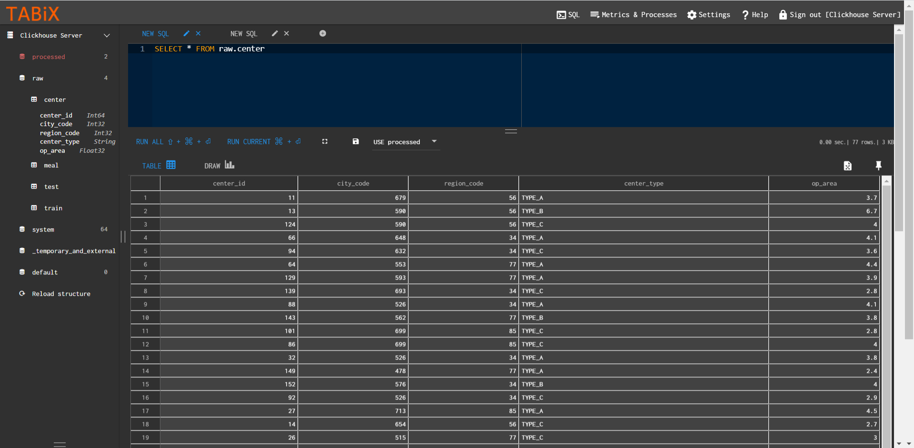
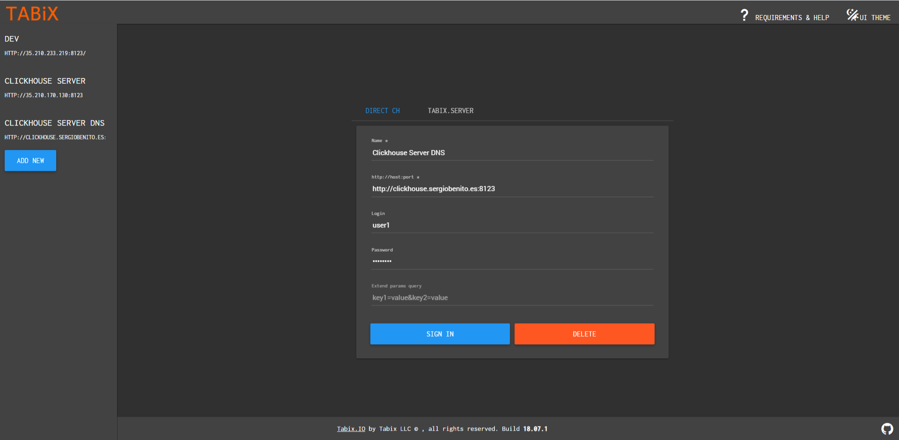

<h1>Config REST API machine</h1>

<h2>Introduction</h2>

Clickhouse allows the project to have a database server to launch queries that process a huge amount of data. In this tutorial it's explanied the process to integrate it.

- [1. Install components for the server](#1-install-components-for-the-server)
- [2. Set SSH keys in GitHub and clone repository](#2-set-ssh-keys-in-github-and-clone-repository)
- [3. Install Docker](#3-install-docker)
- [4. Install Docker Compose](#4-install-docker-compose)
- [5. Create config files](#5-create-config-files)
	- [5.1. `users.xml`](#51-usersxml)
	- [5.2. `custom_confing.xml`](#52-custom_confingxml)
	- [5.3. `src/deploy/init-db.sh`](#53-srcdeployinit-dbsh)
	- [5.4. `data/ClickhouseClient.py`](#54-dataclickhouseclientpy)
	- [5.5. `init_clickhouse.py`](#55-init_clickhousepy)
- [Launch with docker-compose](#launch-with-docker-compose)
- [6. Connect to Clickhouse with HTTP client](#6-connect-to-clickhouse-with-http-client)

## 1. Install components for the server

For this server it's used a Ubuntu machine v18.04 LTS with 2 CPUs and 4 GB of memory, besides its estimated cost is $27,31 in europe-west1 region, if machine was always on.

```
# update system packages and install the required packages
sudo apt-get update
sudo apt-get install bzip2 libxml2-dev libsm6 libxrender1 libfontconfig1 git
sudo apt-get install python3-pip python3-dev build-essential libssl-dev libffi-dev python3-setuptools
sudo apt install python3-venv
```
## 2. Set SSH keys in GitHub and clone repository

```
ssh-keygen -t rsa -b 4096 -C "youremail@email.com"

cat .ssh/id_rsa.pub
```

```
git config --global user.email "you@example.com"
git config --global user.name "Your Name"

# clone the project repo
git clone git@github.com:sergiobemar/tfg-sb-meal-delivery-prediction-api.git
```

## 3. Install Docker

To install Docker it's possible following [this tutorial](https://www.digitalocean.com/community/tutorials/como-instalar-y-usar-docker-en-ubuntu-18-04-1-es):

```
sudo apt install apt-transport-https ca-certificates curl software-properties-common

curl -fsSL https://download.docker.com/linux/ubuntu/gpg | sudo apt-key add -
sudo add-apt-repository "deb [arch=amd64] https://download.docker.com/linux/ubuntu bionic stable"
sudo apt update

apt-cache policy docker-ce
sudo apt install docker-ce

sudo systemctl status docker
```

Then, current user is added to *docker* group.

```
sudo usermod -aG docker ${USER}
```

Now, you have to close the session on the server, so you can restart it or write the following command:

```
su - ${USER}
```

After that, you can check that your user is in Docker group.

```
id -nG
```

## 4. Install Docker Compose

It's used [docker docs web](https://docs.docker.com/compose/install/) to follow the installation steps.

```
# Get the current stable release of Docker Compose
sudo curl -L "https://github.com/docker/compose/releases/download/1.27.1/docker-compose-$(uname -s)-$(uname -m)" -o /usr/local/bin/docker-compose

# Add execution permissions to the binary
sudo chmod +x /usr/local/bin/docker-compose

# Check the version in order to test the installation
docker-compose --version
```

## 5. Create config files

For a basic configurtion it's important at least to configure the following files and parameters:

### 5.1. `users.xml`

This file overrides the default user configuration file, here it's set the different users who have access to Clickhouse and other settings.

The configuration made is to add a user who manages Clickhouse, for that it's necessary add the following lines:

```
[...]

<users>
			[...]

			<!-- Password could be specified in plaintext or in SHA256 (in hex format).
				If you want to specify password in plaintext (not recommended), place it in 'password' element.
				Example: <password>qwerty</password>.
				Password could be empty.
				If you want to specify SHA256, place it in 'password_sha256_hex' element.
				Example: <password_sha256_hex>65e84be33532fb784c48129675f9eff3a682b27168c0ea744b2cf58ee02337c5</password_sha256_hex>
				How to generate decent password:
				Execute: PASSWORD=$(base64 < /dev/urandom | head -c8); echo "$PASSWORD"; echo -n "$PASSWORD" | sha256sum | tr -d '-'
				In first line will be password and in second - corresponding SHA256.
			-->
			<user1>
				<password_sha256_hex>[PASSWORD SHA256]</password_sha256_hex>	
				<networks incl="networks" replace="replace">
					<ip>::/0</ip>
				</networks>	
				<profile>default</profile>
				<quota>default</quota>
				<listen_host>0.0.0.0</listen_host>
			</user1>

			[...]
</users>

[...]

```

To secure the password, use the tag `<password_sha256_hex>` instead of `<password>`, because it saves the encrypt password, you can change `[PASSWORD SHA256]` by yours. To get a hash of a specific string, you can get it using these comands and get the value of the first line:

```
PASSWORD=$(base64 < /dev/urandom | head -c8); echo "$PASSWORD"; echo -n "$PASSWORD" | sha256sum | tr -d '-'
```

### 5.2. `custom_confing.xml`

Override the general configuration file only with the edited tags, so if we only want to edit `<listen_host>` it isn't needed to add more tags than one. It's edited this tag in order to allow the trafic from all host.

```
<yandex>
        <listen_host>0.0.0.0</listen_host>
</yandex>
```

### 5.3. `src/deploy/init-db.sh`

Initialized the database with several schemas using the command `clickhouse-client`

### 5.4. `data/ClickhouseClient.py`

Custom class which extends `clickhouse-driver.Client` created so that the process to execute queries is more simple and less verbose.

### 5.5. `init_clickhouse.py`

This Python script use the last class in order to setup Clickhouse server both creating the specific schemas and tables and inserting the [data from csv files](../api/data).

This script uses the JSON file `clickhouse_config.json` to receive the schema of the tables and the paths where they are saved.

```
files = [
	
	[...],

	{
		"table_name" : "meal",
		"path" : "./api/data/raw/meal_info.csv",
		"schema" : [
			{
				"name" : "meal_id",
				"type" : "Int64"
			},
			{
				"name" : "category",
				"type" : "String"
			},
			{
				"name" : "cuisine",
				"type" : "String"
			}
		]
	},

	[...],

]
```

Also, in order to allow the connect, it receive the credentials from `.credentials/clickhouse_credentials.json`. The template of this file will be the following:

```
{
	"host" : "x.x.x.x",
	"port" : 9000,
    "user" : "username",
    "password" : "password",
	"database" : "default"
}
```

To run the script use this command:

```
python clickhouse/init_clickhouse.py
```

## Launch with docker-compose

Now, everything is ready to create the `docker-file.yml` and launch it. The file would be similar like this, where every script is referenced by a volume and also, to allow the traffic, both 9000 and 8123 ports are opened:

```
version: '3'

services:

  clickhouse:
    image: yandex/clickhouse-server
    hostname: clickhouse
    container_name: clickhouse
    restart: always
    ports:
      - 9001:9000
      - 8123:8123
    volumes:
      - ./data:/var/lib/clickhouse
      - ./custom_config.xml:/etc/clickhouse-server/config.d/custom_config.xml
      - ./users.xml:/etc/clickhouse-server/users.xml
      - ../api/data/raw/:/var/lib/clickhouse/user_files/
      - ./src/deploy/:/docker-entrypoint-initdb.d/
    ulimits:
      nofile:
        soft: 262144
        hard: 262144

```

To launch it, run the following comands:

```
docker-compose build
docker-compose up -d
```

## 6. Connect to Clickhouse with HTTP client

Clickhouse allows the user to connect to the database using *http* protocol, for that, it's mandatory to open 8123 port. 

[*Tabbix*](http://ui.tabix.io/) provides an *http* web client to execute queries over a Clickhouse server.



Only for the login it's necessary to add the following parameteres:

+ `http://host:port` : the port usually is 8123
+ `login` : the username of your user in Clickhouse
+ `password` : his password



<h2>Useful links</h2>

+ [Clickhouse - Configuration files](https://clickhouse.tech/docs/en/operations/configuration-files/#configuration_files)
+ [clickhouse-driver](https://clickhouse-driver.readthedocs.io/)
+ [clickhouse-r](https://github.com/hannesmuehleisen/clickhouse-r)
+ [Docker Hub - yandex/clickhouse-server](https://hub.docker.com/r/yandex/clickhouse-server/)
+ [GitHub - ClickHouse Server Docker Image](https://github.com/ClickHouse/ClickHouse/tree/master/docker/server)
+ [GitHub - clickhouse with docker-compose running](https://github.com/rongfengliang/clickhouse-docker-compose)
+ [GiHub - clickhouse-zedcd](https://github.com/Slach/clickhouse-zetcd)
+ [GitHub - docker-clickhouse](https://github.com/crobox/docker-clickhouse/blob/master/Dockerfile)
+ [Stackoverflow - creating db and tables in a dockerized Clickhouse instance from docker-compose file](https://stackoverflow.com/questions/52198099/creating-db-and-tables-in-a-dockerized-clickhouse-instance-from-docker-compose-f)