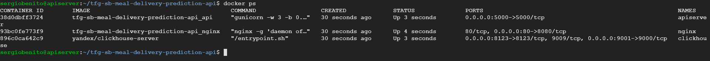

<h1>Config REST API machine</h1>

<h2>Introduction</h2>

<h2>Steps</h2>

- [1. Install components for the server](#1-install-components-for-the-server)
- [2. Set SSH keys in GitHub and clone repository](#2-set-ssh-keys-in-github-and-clone-repository)
- [3. Activate Python virtual environment](#3-activate-python-virtual-environment)
- [4. Install libraries for the first time](#4-install-libraries-for-the-first-time)
- [5. Test the API with Uvicorn](#5-test-the-api-with-uvicorn)
- [6. Configure Gunicorn](#6-configure-gunicorn)
- [7. Setting up the API in Docker](#7-setting-up-the-api-in-docker)
- [8. Add the Nginx container](#8-add-the-nginx-container)
- [9. Install Docker](#9-install-docker)
- [10. Install Docker Compose](#10-install-docker-compose)
- [11. Configure Docker Compose file](#11-configure-docker-compose-file)
- [12. Test docker-compose](#12-test-docker-compose)

### 1. Install components for the server

For this server it's used a Ubuntu machine v18.04 LTS with 2 CPUs and 4 GB of memory, besides its estimated cost is $27,31 in europe-west1 region, if machine was always on.

```
# update system packages and install the required packages
sudo apt-get update
sudo apt-get install bzip2 libxml2-dev libsm6 libxrender1 libfontconfig1 git
sudo apt-get install python3-pip python3-dev build-essential libssl-dev libffi-dev python3-setuptools
sudo apt install python3-venv
```
### 2. Set SSH keys in GitHub and clone repository

```
ssh-keygen -t rsa -b 4096 -C "youremail@email.com"

cat .ssh/id_rsa.pub
```

```
git config --global user.email "you@example.com"
git config --global user.name "Your Name"

# clone the project repo
git clone git@github.com:sergiobemar/tfg-sb-meal-delivery-prediction-api.git
```

### 3. Activate Python virtual environment

```
cd tfg-sb-meal-delivery-prediction-api/

python3 -m venv env

source env/bin/activate
```

### 4. Install libraries for the first time

```
pip3 install cmake wheel
pip3 install gunicorn uvicorn fastapi uvloop httptools

pip3 install joblib numpy pandas xgboost

```

### 5. Test the API with Uvicorn

In order to test the API, you can run it in your local machine usign ```Uvicorn```.

```
uvicorn api.app:app --host 0.0.0.0 --port 5000 --reload --debug --workers 3
```

The parameters used are the following:

+ ```api.app:app```: The ASGI application to run, in the format ```"<module>:<attribute>"```.
+ ```--host 0.0.0.0```: Make the API server available on the network.
+ ```--port 5000```: Bind to a socket with port 5000.
+ ```--reload```: Restart workers when code changes.
+ ```-workers 3```: Use multiple worker processes.

### 6. Configure Gunicorn

In order to keep cleaned and sorted the repository, it's changed the structure saving everything created before, all regarding to model and preprocessing scripts besides the source, in a subfolder named as *api*.

For production server, it's neccessary use Gunicorn instead of Uvicorn and also, in order to keep the async functionality, launch it with this parameter ```gunicorn -k uvicorn.workers.UvicornWorker```.

```
gunicorn api.app:app --bind 0.0.0.0:5000 -w 4 -k uvicorn.workers.UvicornWorker
```

The parameters used are the following:

+ ```--bind 0.0.0.0:5000```: Make the API server available on the network using de 5000 port.
+ ```-w 4```: Use multiple worker processes.
+ ```-k uvicorn.workers.UvicornWorker```: *Uvicorn* includes a gunicorn worker class that means you can get set up with very little configuration.


After the API server is started, you can stop it and deactivate the virtual environment.

```
(env) deactivate
```

It's possible to run the script programmatically usign Uvicorn. Create a file ```example.py``` and added the following lines:

```
import uvicorn

class App:
    ...

app = App()

if __name__ == "__main__":
	uvicorn.run("app:app", host='0.0.0.0', port=5000, reload=True, debug=True, workers=3)
```

For more info, you can see it in [Uvicorn website](https://www.uvicorn.org/deployment/#running-programmatically).

### 7. Setting up the API in Docker

Create an empty ```__init__.py``` in ```api/``` and create ```requirements.txt```.

```
touch __init__.py
pip freeze > requirements.txt
```

And then, it's created ```Dockerfile``` with the following code:

```
FROM python:3.6

#update
RUN apt-get update 

#install requirements
COPY ./api/requirements.txt /tmp/requirements.txt
WORKDIR /tmp
RUN pip3 install -r requirements.txt

#copy app
COPY api /api
WORKDIR /

COPY .credentials /.credentials

CMD ["gunicorn", "-w", "3", "-b", "0.0.0.0:5000", "-t", "360", "--reload", "api.app:app", "-k", "uvicorn.workers.UvicornWorker"]
```

### 8. Add the Nginx container

```
tfg-sb-meal-delivery-prediction-api
|- api
   ...
|- nginx
	|- nginx.conf
	|- Dockerfile
```

Added the following files ```nginx.conf``` and its ```Dockerfile```. Let's see the code for the first one:

```
worker_processes  3;

events { }

http {

  keepalive_timeout  360s;

  server {

      listen 8080;
      server_name api;
      charset utf-8;

      location / {
          proxy_pass http://api:5000;
          proxy_set_header Host $host;
          proxy_set_header X-Real-IP $remote_addr;
          proxy_set_header X-Forwarded-For $proxy_add_x_forwarded_for;
      }
  }
}
```

And the ```Dockerfile``` for the nginx:

```
FROM nginx:1.15.2

RUN rm /etc/nginx/nginx.conf
COPY nginx.conf /etc/nginx/
```

### 9. Install Docker

To install Docker it's possible following [this tutorial](https://www.digitalocean.com/community/tutorials/como-instalar-y-usar-docker-en-ubuntu-18-04-1-es):

```
sudo apt install apt-transport-https ca-certificates curl software-properties-common

curl -fsSL https://download.docker.com/linux/ubuntu/gpg | sudo apt-key add -
sudo add-apt-repository "deb [arch=amd64] https://download.docker.com/linux/ubuntu bionic stable"
sudo apt update

apt-cache policy docker-ce
sudo apt install docker-ce

sudo systemctl status docker
```

Then, current user is added to *docker* group.

```
sudo usermod -aG docker ${USER}
```

Now, you have to close the session on the server, so you can restart it or write the following command:

```
su - ${USER}
```

After that, you can check that your user is in Docker group.

```
id -nG
```

### 10. Install Docker Compose

It's used [docker docs web](https://docs.docker.com/compose/install/) to follow the installation steps.

```
# Get the current stable release of Docker Compose
sudo curl -L "https://github.com/docker/compose/releases/download/1.27.1/docker-compose-$(uname -s)-$(uname -m)" -o /usr/local/bin/docker-compose

# Add execution permissions to the binary
sudo chmod +x /usr/local/bin/docker-compose

# Check the version in order to test the installation
docker-compose --version
```

### 11. Configure Docker Compose file

```
tfg-sb-meal-delivery-prediction-api
|- api
   ...
|- nginx
   ...
|- docker-compose.yml
```

The code:

```
version: '3'

services:

  api:
    container_name: apiserver
    restart: always
    build:
      context: .
      dockerfile: ./api/Dockerfile
    volumes: ['./api:/api']
    networks:
      - apinetwork
    expose:
      - "5000"
    ports:
      - "5000:5000"

  nginx:
    container_name: nginx
    restart: always
    build: ./nginx
    networks:
      - apinetwork
    expose:
      - "8080"
    ports:
      - "80:8080"
  
  clickhouse:
    image: yandex/clickhouse-server
    hostname: clickhouse
    container_name: clickhouse
    ports:
      - 9001:9000
      - 8123:8123
    volumes:
      - ./clickhouse/custom_config.xml:/etc/clickhouse-server/config.d/custom_config.xml
      - ./clickhouse/users.xml:/etc/clickhouse-server/users.xml
      - ./api/data/raw:/var/lib/clickhouse/user_files/raw
      - ./api/data/processed:/var/lib/clickhouse/user_files/processed
    ulimits:
      nofile:
        soft: 262144
        hard: 262144

networks:
  apinetwork:
```

The containers launched by ```docker-compose``` would be the following:
+ ```api``` : builds the *FastAPI* server using its *[Dockerfile](../api/Dockerfile)* and launches it using 5000 port.
+ ```nginx``` : builds Nginx proxy using its *[Dockerfile](../nginx/Dockerfile)* and launch it. In addition, it redirects the exposed port to 80.
+ ```clickhouse``` : launches Clickhouse from the official image and opens the ports 9001 in order to allow the clients to connect and 8123 for http connections, which will serve to test the database.

### 12. Test docker-compose

It's the end of the configuration, if the last steps are ok, you can try to build the docker file using *docker-compose* which creates an image of the three containers, one for nginx, other for gunicorn and the last for Clickhouse. When launch the command ```docker-compose up```, these containers will be up and you can try now to make some request to the API.

```
docker-compose build

docker-compose up -d
```

You can check that everything was right using ```docker ps``` comand which shows the current active containers of the machine, so you should be shown 3 containers one for each of the defined images in the ```docker-compose``` file.



If you want to re-build the API, you only have to remove the old image and build the another newer, for this you only have to remove the created containers.

```
docker ps
docker-compose rm [IMAGE]
```
However, if you want to stop the Docker containers without being deleted, you only have to run this command from the main path:

```
docker-compose down
```

<h2>Useful links</h2>

+ A production-grade Machine Learning API using Flask, Gunicorn, Nginx, and Docker
  + [Part 1: Setting up our API](https://medium.com/technonerds/a-production-grade-machine-learning-api-using-flask-gunicorn-nginx-and-docker-part-1-49927238befb)
  + [Part 2: Integrating Gunicorn, Nginx and Docker](https://medium.com/technonerds/a-production-grade-machine-learning-api-using-flask-gunicorn-nginx-and-docker-part-2-c69629199037)
  + [Part 3: Flask Blueprints — managing multiple endpoints](https://medium.com/technonerds/a-production-grade-machine-learning-api-using-flask-gunicorn-nginx-and-docker-part-3-flask-30c881a65655)
  + [Part 4: Testing your ML API](https://medium.com/technonerds/a-production-grade-machine-learning-api-using-flask-gunicorn-nginx-and-docker-part-4-unit-c31a92544fd6)
+ [Build a FastAPI Server](https://python-gino.org/docs/en/master/tutorials/fastapi.html)
+ [Building machine learning models with Keras, FastAPI, Redis and Docker](https://morioh.com/p/4e37a3a1ab3d)
+ [Cómo instalar y usar Docker en Ubuntu 18.04](https://www.digitalocean.com/community/tutorials/como-instalar-y-usar-docker-en-ubuntu-18-04-1-es)
+ [Cómo preparar aplicaciones de Flask con Gunicorn y Nginx en Ubuntu 18.04](https://www.digitalocean.com/community/tutorials/como-preparar-aplicaciones-de-flask-con-gunicorn-y-nginx-en-ubuntu-18-04-es)
+ [Deploy FastAPI Application on Ubuntu with Nginx, Gunicorn and Uvicorn](https://blog.nawaz.info/deploy-fastapi-application-on-ubuntu-with-nginx-gunicorn-and-uvicorn)
+ [Deploying a FastAPI app with Docker, Traefik, and Let's Encrypt](https://www.valentinog.com/blog/traefik/)
+ [Deploying an ML Model on Google Compute Engine](https://towardsdatascience.com/deploying-a-custom-ml-prediction-service-on-google-cloud-ae3be7e6d38f)
+ [Deployment could be easy — A Data Scientist’s Guide to deploy an Image detection FastAPI API using Amazon ec2](https://towardsdatascience.com/deployment-could-be-easy-a-data-scientists-guide-to-deploy-an-image-detection-fastapi-api-using-329cdd80400)
+ [FastAPI - Tutorial - User Guide - Intro](https://fastapi.tiangolo.com/tutorial/)
+ [Flask vs FastAPI first impressions](https://dev.to/meseta/flask-vs-fastapi-first-impressions-1bnm)
+ [How to deploy a Python API with FastAPI with Nginx and Docker](https://medium.com/@nuno.m.bispo/how-to-deploy-a-python-api-with-fastapi-with-nginx-and-docker-1328cbf41bc)
+ [Install Docker Compose](https://docs.docker.com/compose/install/)
+ [Is there a difference between running fastapi from uvicorn command in dockerfile and from pythonfile?](https://stackoverflow.com/questions/63177681/is-there-a-difference-between-running-fastapi-from-uvicorn-command-in-dockerfile)
+ [Use FastAPI to build web services in Python](https://fedoramagazine.org/use-fastapi-to-build-web-services-in-python/)
+ [Uvicorn - Deployment](https://www.uvicorn.org/deployment/#running-programmatically)
+ [Where Are Docker Container Logs Stored?](https://sematext.com/blog/docker-logs-location/#:~:text=First%20of%20all%2C%20to%20list,use%20the%20docker%20ps%20command.&text=Then%2C%20with%20the%20docker%20logs,logs%20for%20a%20particular%20container.&text=Most%20of%20the%20time%20you,the%20last%20few%20logs%20lines.)
+ [Why did we choose FAST API over Flask and Django for our RESTFUL Micro-services](https://medium.com/@ahmed.nafies/why-did-we-choose-fast-api-over-flask-and-django-for-our-restful-micro-services-77589534c036)
+ [Why we switched from Flask to FastAPI for production machine learning](https://towardsdatascience.com/why-we-switched-from-flask-to-fastapi-for-production-machine-learning-765aab9b3679)